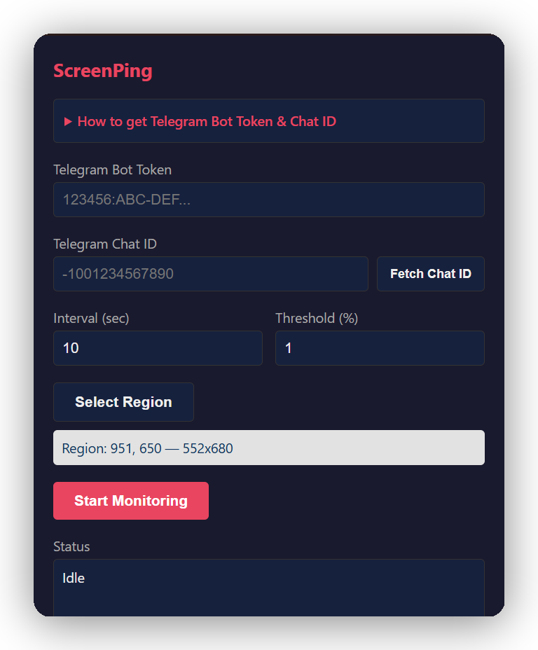

<div align="center">


# ScreenPing

**Watch a screen region. Get a Telegram ping when it changes.**

Perfect for ticket queues, deployment dashboards, or anything you don't want to stare at.



</div>

---

## How it works

1. **Select** a screen region to watch
2. **Monitor** — the app takes periodic screenshots of that region
3. **Compare** — each screenshot is diffed against the previous one (pixel-level)
4. **Alert** — if the change exceeds your threshold, a screenshot is sent to Telegram

## Quick start

```bash
npm install
npm start
```

> Requires **Node.js 18+**

## Telegram setup

1. Open [@BotFather](https://t.me/BotFather) in Telegram and send `/newbot`
2. Copy the bot token
3. Send `/start` to your new bot (so it can message you)
4. Paste the token into ScreenPing and click **Fetch Chat ID**

That's it — you'll now receive screenshots in Telegram whenever the watched region changes.

## Global hotkey

| Shortcut | Action |
|---|---|
| `Ctrl+Shift+Space` | Toggle monitoring on/off |

Works even when ScreenPing is in the background.

## Building

Each platform must be built on that platform — Electron does not support cross-compilation.

| Platform | Command | Output |
|---|---|---|
| Windows | `npm run build` | `dist/ScreenPing 1.0.0.exe` (portable) |
| macOS | `npm run build:mac` | `dist/ScreenPing-1.0.0.dmg` |
| Linux | `npm run build:linux` | `dist/ScreenPing-1.0.0.AppImage` |

## License

ISC
